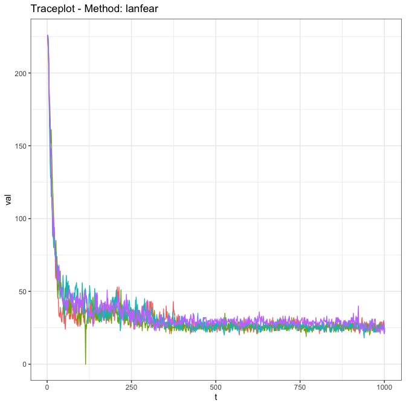
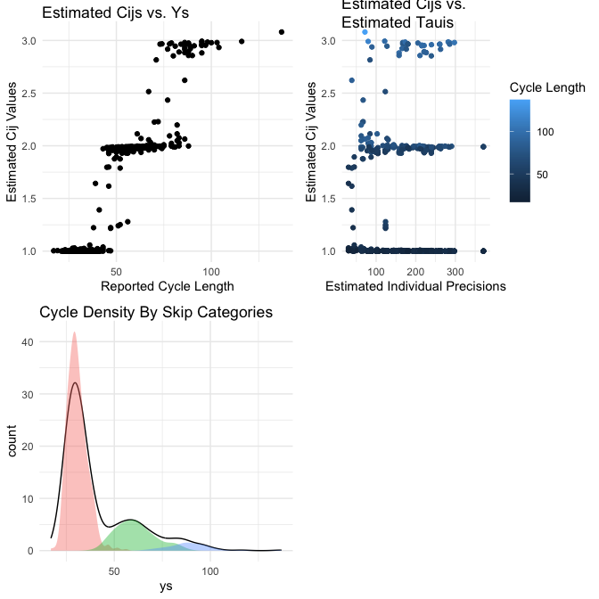

<!-- README.md is generated from README.Rmd. Please edit that file -->

# skipTrack

<!-- badges: start -->

[](https://lifecycle.r-lib.org/articles/stages.html#experimental)
[](https://github.com/LukeDuttweiler/skipTrack/actions/workflows/R-CMD-check.yaml)
[](https://CRAN.R-project.org/package=skipTrack)
<!-- badges: end -->

Welcome to the SkipTrack Package!

SkipTrack is a Bayesian hierarchical model for self-reported menstrual
cycle length data on mobile health apps. The model is an extension of
the hierarchical model presented in Li et al. (2022) that focuses on
predicting an individual’s next menstrual cycle start date while
accounting for cycle length inaccuracies introduced by non-adherence in
user self-tracked data. Check out the ‘Getting Started’ vignette to see
an overview of the SkipTrack Model!

## Installation

``` r
#Install from CRAN
install.packages('skipTrack')

#Install Development Version
devtools::install_github("LukeDuttweiler/skipTrack")
```

# Package Usage

The SkipTrack package provides functions for fitting the SkipTrack
model, evaluating model run diagnostics, retrieving and visualizing
model results, and simulating related data. We begin our tutorial by
examining some simulated data.

``` r
library(skipTrack)
```

First, we simulate data on 100 individuals from the SkipTrack model
where each observed $y_{ij}$ value has a 75% probability of being a true
cycle, a 20% probability of being two true cycles recorded as one, and a
5% probability of being three true cycles recorded as one.

``` r
set.seed(1)

#Simulate data
dat <- skipTrack.simulate(n = 100, model = 'skipTrack', skipProb = c(.75, .2, .05))
```

Fitting the SkipTrack model using this simulated data requires a call to
the function `skipTrack.fit`. Note that because this is a Bayesian model
and is fit with an MCMC algorithm, it can take some time with large
datasets and a high number of MCMC reps and chains.

In this code we ask for 4 chains, each with 1000 iterations, run
sequentially. Note that we recommend allowing the sampler to run longer
than this (usually at least 5000 iterations per chain), but we use a
short run here to save time.

If `useParallel = TRUE`, the MCMC chains will be evaluated in parallel,
which helps with longer runs.

``` r
ft <- skipTrack.fit(Y = dat$Y, cluster = dat$cluster,
                    reps = 1000, chains = 4, useParallel = FALSE)
```

Once we have the model results we are able to examine model diagnostics,
visualize results from the model, and view a model summary.

### Diagnostics

Multivariate, multichain MCMC diagnostics, including traceplots,
Gelman-Rubin diagnostics, and effective sample size, are all available
for various parameters from the model fit. These are supplied using the
`genMCMCDiag` package, see that packages’ documentation for details.

Here we show the output of the diagnostics on the $c_{ij}$ parameters,
which show that (at least for the $c_{ij}$ values) the algorithm is
mixing effectively (or will be, once the algorithm runs a little
longer).

``` r
skipTrack.diagnostics(ft, param = 'cijs')
```



    #> ----------------------------------------------------
    #> Generalized MCMC Diagnostics using Custom Method 
    #> ----------------------------------------------------
    #> 
    #> |Effective Sample Size: 
    #> |---------------------------
    #> | Chain 1| Chain 2| Chain 3| Chain 4|     Sum|
    #> |-------:|-------:|-------:|-------:|-------:|
    #> |  86.077|    81.6|  91.054| 114.178| 372.909|
    #> 
    #> |psrf: 
    #> |---------------------------
    #> | Point est.| Upper C.I.|
    #> |----------:|----------:|
    #> |      1.001|      1.005|

### Visualization

In order to see some important plots for the SkipTrack model fit, you
can simply use `plot(ft)`, and the plots are directly accessible using
`skipTrack.visualize(ft)`.

``` r
plot(ft)
```



### Summary

A summary is available for the SkipTrack model fit with `summary(ft)`,
with more detailed results accessible through `skipTrack.results(ft)`.
Importantly, these results are based on a default chain burn-in value of
750 draws. This can be changed using the parameter `burnIn` for either
function.

For example using `summary` with the default burnIn…

``` r
summary(ft)
```

produces the following output:

    #> ----------------------------------------------------
    #> Summary of skipTrack.fit using skipTrack model
    #> ----------------------------------------------------
    #> Mean Coefficients: 
    #> 
    #>             Estimate       95% CI Lower 95% CI Upper
    #> (Intercept)    3.406              3.376        3.436
    #> 
    #> ----------------------------------------------------
    #> Precision Coefficients: 
    #> 
    #>             Estimate       95% CI Lower 95% CI Upper
    #> (Intercept)     5.36              5.134        5.593
    #> 
    #> ----------------------------------------------------
    #> Diagnostics: 
    #> 
    #>        Effective Sample Size       Gelman-Rubin
    #> Betas                 4004.0                  1
    #> Gammas                  21.8                  1
    #> cijs                   351.1                  1
    #> 
    #> ----------------------------------------------------

On the other hand if we change the burnIn to 500…

``` r
summary(ft, burnIn = 500)
```

we see:

    #> ----------------------------------------------------
    #> Summary of skipTrack.fit using skipTrack model
    #> ----------------------------------------------------
    #> Mean Coefficients: 
    #> 
    #>             Estimate       95% CI Lower 95% CI Upper
    #> (Intercept)    3.407              3.378        3.437
    #> 
    #> ----------------------------------------------------
    #> Precision Coefficients: 
    #> 
    #>             Estimate       95% CI Lower 95% CI Upper
    #> (Intercept)    5.342              5.125        5.569
    #> 
    #> ----------------------------------------------------
    #> Diagnostics: 
    #> 
    #>        Effective Sample Size       Gelman-Rubin
    #> Betas                4004.00                  1
    #> Gammas                 21.77                  1
    #> cijs                  460.23                  1
    #> 
    #> ----------------------------------------------------

This introduction provides enough information to start fitting the
SkipTrack model. For further information regarding different methods of
simulating data, additional model fitting, and tuning parameters for
fitting the model, please see the help pages and the ‘Getting Started’
vignette. Additional vignettes are forthcoming.

## Bibliography

<div id="refs" class="references csl-bib-body hanging-indent"
entry-spacing="0">

<div id="ref-li2022predictive" class="csl-entry">

Li, Kathy, Iñigo Urteaga, Amanda Shea, Virginia J Vitzthum, Chris H
Wiggins, and Noémie Elhadad. 2022. “A Predictive Model for Next Cycle
Start Date That Accounts for Adherence in Menstrual Self-Tracking.”
*Journal of the American Medical Informatics Association* 29 (1): 3–11.
<https://doi.org/10.1093/jamia/ocab182>.

</div>

</div>
